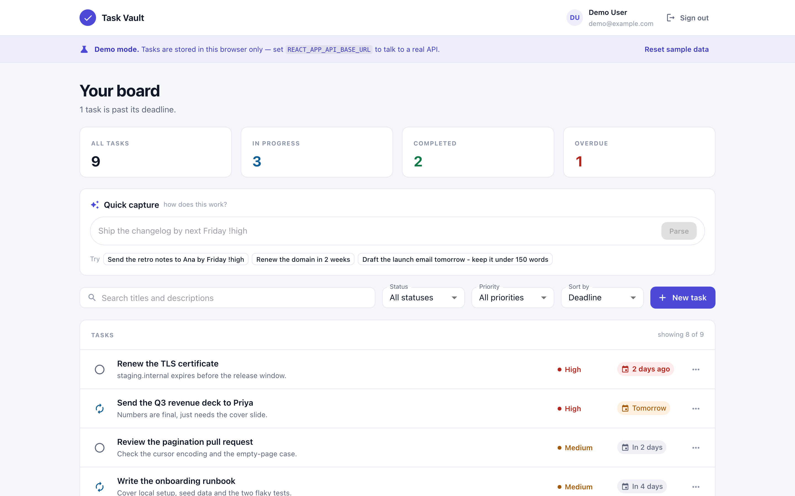
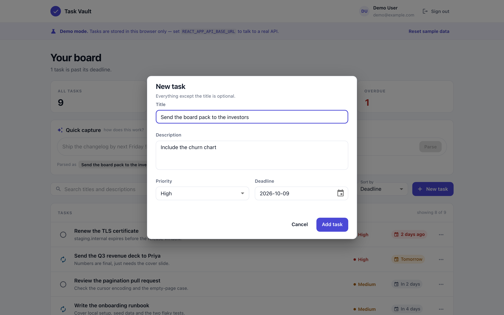
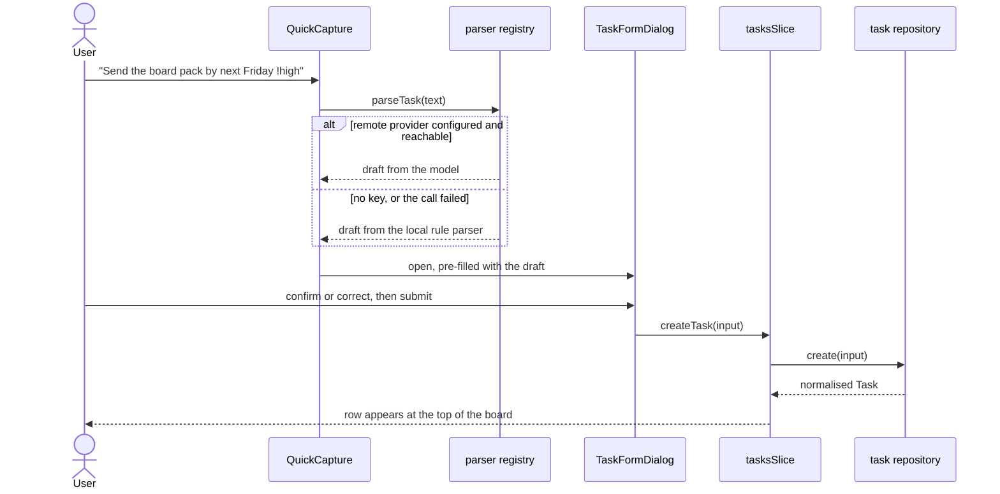
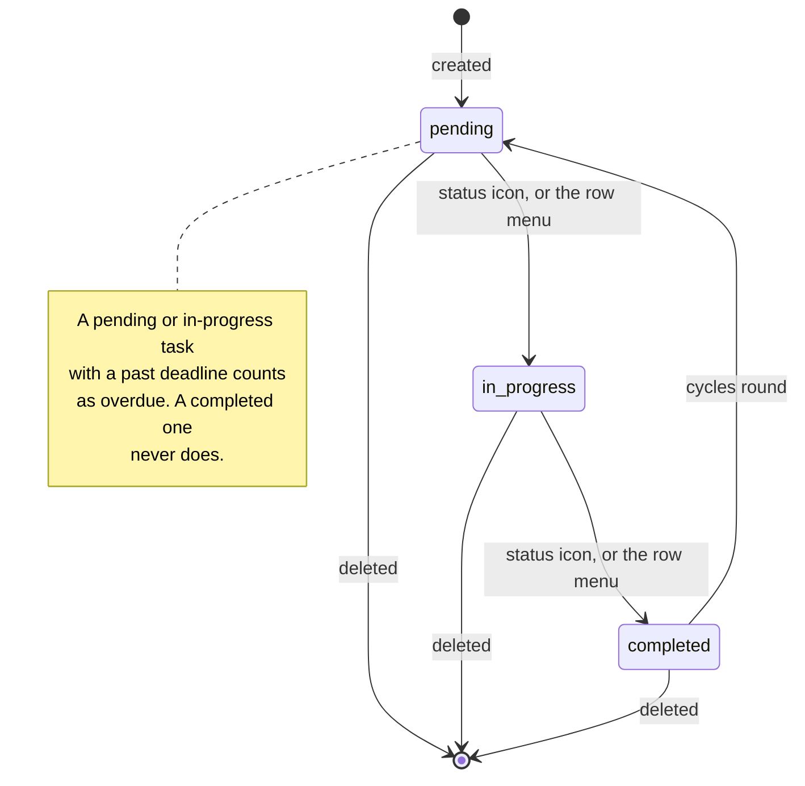
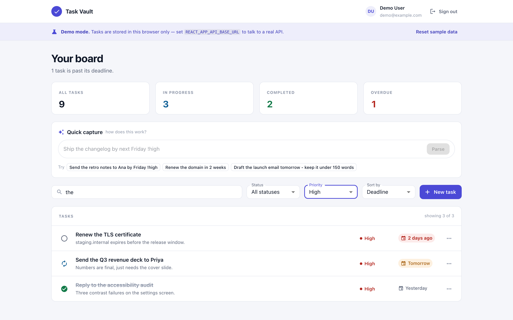
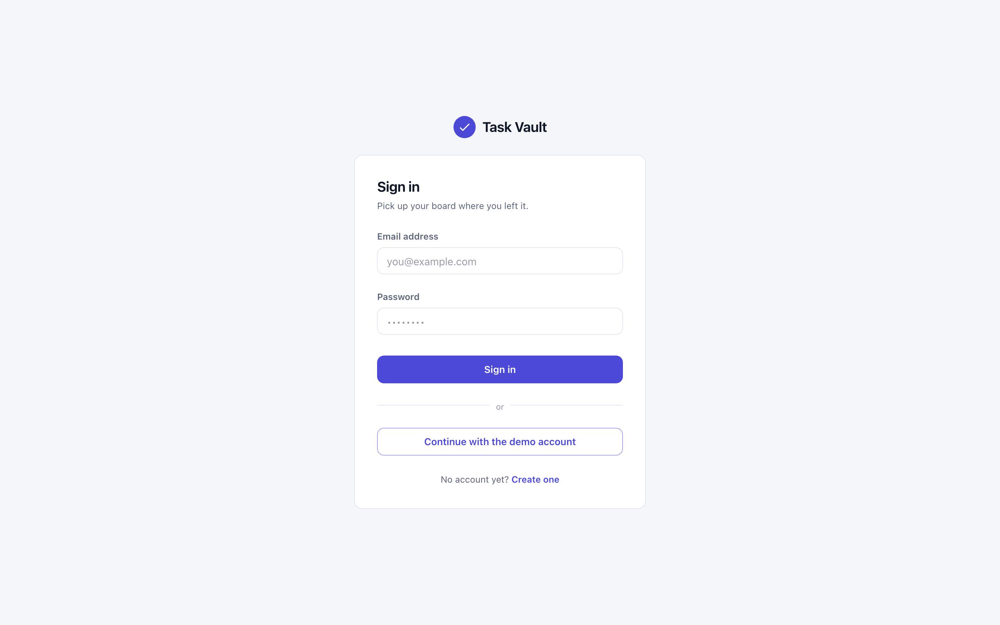

# Task Vault

A React task board: filterable, sortable, paginated, and able to turn a line of
plain English into a task. It runs with no backend — clone it, `npm start`, and
you get a seeded board straight away.



## What you get on a fresh clone

`REACT_APP_API_BASE_URL` is empty in `.env.example`, and an empty base URL turns
on **demo mode**: the app swaps its HTTP repositories for in-browser ones backed
by `localStorage` and seeds nine tasks with deadlines relative to today. Nothing
to install, nothing to run alongside it.

```bash
npm install
npm start          # http://localhost:3000, or set PORT
```

The demo repository is a real implementation of the same contract the HTTP one
satisfies, not a mock — which is why the test suite can exercise it directly.

## Turning a sentence into a task

Typing into **Quick capture** pulls a title, a priority and a deadline out of
one line and opens the task form pre-filled. It never writes a task on its own;
you confirm or correct the draft first.



| You type | Title | Priority | Deadline |
|---|---|---|---|
| `Ship the changelog by next Friday !high` | Ship the changelog | high | the Friday after this one |
| `Renew the domain in 2 weeks` | Renew the domain | medium | today + 14 days |
| `Patch the auth bug p1` | Patch the auth bug | high | none |
| `urgent call with legal` | Call with legal | high | none |
| `Draft the launch email tomorrow - keep it under 150 words` | Draft the launch email | medium | tomorrow |

Dates it understands: `today`, `tomorrow`, `next week`, `end of month`,
`in N days` / `in N weeks`, a bare or `next` weekday, `YYYY-MM-DD`, and
`<month> <day>`. Priority comes from `!high` / `!medium` / `!low`, `p1` / `p2` /
`p3`, or words like *urgent* and *someday*. Anything after ` - ` becomes the
description. Two parsers are registered in `src/services/ai/index.js`:

- **`local`** — the rule parser above. Deterministic, offline, no credentials,
  and unit-tested against a fixed clock in `localTaskParser.test.js`.
- **`remote`** — an OpenAI-compatible chat-completions endpoint. It reports
  itself unavailable unless both `REACT_APP_AI_ENDPOINT` and
  `REACT_APP_AI_API_KEY` are set.

`parseWithProvider` falls back to `local` whenever the named provider is
unknown, unavailable, or throws, and the model's reply is run through
`coerceRemoteResult` before it is trusted — a missing title, an invented
priority or a non-ISO date is discarded rather than shown to the user. The
quick-capture control therefore behaves identically with and without a key, and
there is no failure path that leaves the form empty.

## Where a task comes from



## The task repository contract

Every read and write goes through one interface, documented in
`src/services/tasks/taskRepository.js`:

```
list()                   -> Promise<Task[]>
get(id)                  -> Promise<Task>
create(input)            -> Promise<Task>
update(id, input)        -> Promise<Task>
updateStatus(id, status) -> Promise<Task>
remove(id)               -> Promise<void>
```

Two implementations ship. `apiTaskRepository` talks to a REST API that wraps
records as `{ id, attributes: { … } }` and accepts statuses as the integers
`0` / `1` / `2`; `demoTaskRepository` keeps flat rows in `localStorage`. Both
resolve to the same normalised `Task` shape, so no component and no reducer
knows which one is in play. `resolveTaskRepository()` picks one from config and
`setTaskRepository()` injects a stub in tests. `assertTaskRepository` fails
loudly, naming the missing methods, if a third implementation is incomplete.

## Task states



Clicking the icon at the left of a row advances it one step; the overflow menu
jumps to any other status. Completed tasks sort below unfinished ones in every
ordering, so finished work never sits at the top of the board.

## Finding things



Search matches titles and descriptions, and combines with the status and
priority filters and a sort key. Filtering and sorting live in
`src/domain/taskQuery.js` as pure functions and are wrapped in `createSelector`,
so they run once per `(tasks, query)` pair rather than on every keystroke of
every row. The list pages at `REACT_APP_PAGE_SIZE` rows (8 by default);
`paginate()` clamps an out-of-range page instead of rendering an empty one, and
changing any filter returns you to page one.

Paging is client-side because the API returns every task in one response, and is
confined to one function so moving it server-side is a change in one place.

## Signing in



With an API configured, `/login` and `/sign-up` post to it and the returned
token is stored and attached by an axios request interceptor. A 401 or 403 on
any request clears the token once, in one response interceptor, and dispatches
`sessionExpired()` so the store empties itself.

In demo mode there is no server to authenticate against, so `ProtectedRoute`
opens a demo session itself rather than bouncing a first-time visitor to a form
that would accept anything. The sign-in screen stays reachable at `/login` and
offers the same demo account explicitly.

## Talking to a real API

```bash
cp .env.example .env
# REACT_APP_API_BASE_URL=https://your-task-api.example.com
npm start
```

The client expects `POST /login`, `POST /sign_up`, `DELETE /logout` and
`/api/v1/tasks` with the usual five verbs. Create React App inlines `REACT_APP_*`
values **at build time**, so changing the base URL means a rebuild, not a
restart — which is why the Docker image takes it as a build argument. Everything
configurable is read once in `src/config/index.js`; no component reaches into
`process.env`.

## How the source is arranged

```
src/
  config/      every environment-dependent value, resolved once
  domain/      task vocabulary, filtering, sorting, paging, summaries — pure
  services/
    http/      one axios instance, its interceptors and error flattening
    tasks/     the repository contract and its two implementations
    auth/      sign-in, sign-up, sign-out against API or demo
    ai/        the parser registry, the local rule parser, the remote provider
  store/       Redux Toolkit slices, thunks and memoised selectors
  modules/     the two screens: Tasks and Authorization
  components/  page chrome and the shared, presentational pieces
  routes/      route table and the auth guard
  theme/       the single palette, type scale and component overrides
```

Dependencies point one way: `domain/` imports nothing outside itself,
`services/` imports `domain/` and `config/`, `store/` imports `services/`, and
only `modules/` and `components/` import React.

## Tests

```bash
npm test            # watch mode
npm run test:ci     # single run
```

95 tests across 12 suites, all passing. They cover the pure domain functions,
the natural-language parser against a fixed clock, the demo repository's CRUD
and persistence, the repository-contract assertion, both Redux slices with a
stubbed repository, the HTTP error flattener, and the task list's loading,
empty, filtered-empty, error and populated states in React Testing Library.

```bash
npm run lint          # ESLint, react-app config plus prettier
npm run format:check  # Prettier
```

## Docker

Multi-stage: `node:22-alpine` builds, `nginx:1.27-alpine` serves. The runtime
stage drops to the `nginx` user, listens on 8080 because a non-root process
cannot bind below 1024, and the compose service adds `read_only: true`,
`no-new-privileges` and tmpfs mounts for the paths nginx writes to.

```bash
docker compose up --build          # http://localhost:7131
WEB_PORT=8000 docker compose up    # somewhere else
```

With no `REACT_APP_API_BASE_URL` in the environment the image is built in demo
mode. To bake in a real API:

```bash
REACT_APP_API_BASE_URL=https://your-task-api.example.com docker compose up --build
```

`nginx.conf` caches hashed bundles for a year, serves `index.html` with
`no-store`, and falls back to it so `/login` and `/sign-up` survive a refresh.

## Known limits

- **The token lives in `localStorage`.** That is what the API's `Authorization`
  header flow assumes, and it is readable by any script on the page. An
  httpOnly cookie would be the fix, and it needs a server change.
- **Filtering, sorting and paging happen in the browser.** Fine for a personal
  board, wrong at ten thousand tasks. `taskQuery.js` and `paginate()` are the
  two places that would move server-side.
- **Mutations are not optimistic.** Each one waits for the repository before the
  row changes, so a slow API shows a visible delay.
- **Demo mode is not authentication.** It accepts any well-formed credentials
  because there is nothing to check them against.
- **No end-to-end tests.** The screenshots under `docs/screenshots/` were taken
  with Playwright against the dev server, but that script is not checked in.
